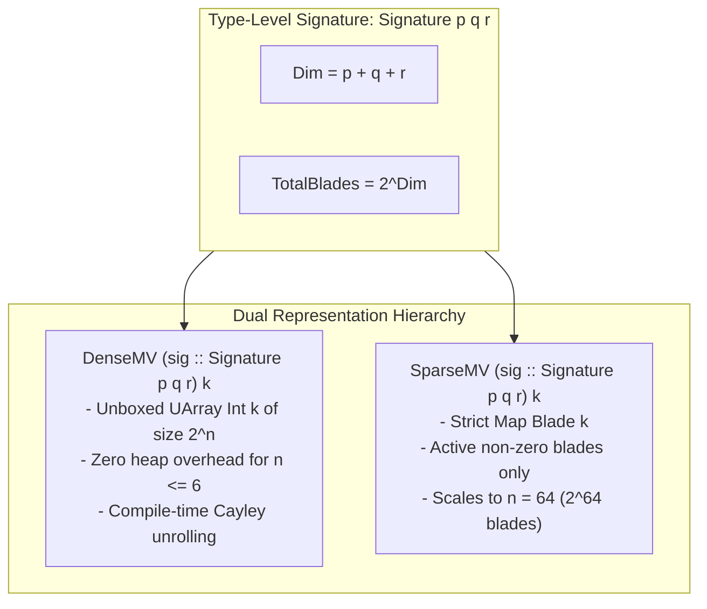
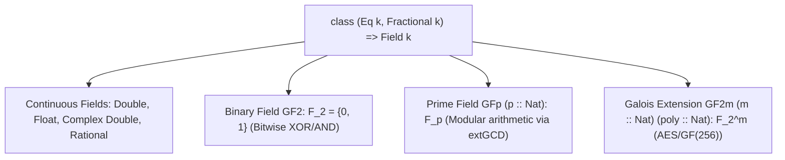

# System & Mathematical Architecture for `cliff`

## 1. Overview
`cliff` is a high-performance, general-purpose Clifford Algebra (Geometric Algebra) library written in **Pure Haskell**. It provides a unified mathematical foundation parameterized over arbitrary metric signatures $Cl(p,q,r)$ and scalar fields (continuous, rational, and finite Galois fields), with zero external runtime dependencies.

---

## 2. Type-Level Signature & Dual Memory Models



### Representation Selection
- **`DenseMV`**: Statically sized unboxed array holding exactly $2^n$ coefficients. Used for low-to-medium dimensional spaces ($n \le 6$, such as 2D Euclidean, 3D Euclidean $Cl(3,0,0)$, Spacetime $Cl(1,3,0)$, and 3D PGA $Cl(3,0,1)$). All products use precomputed or unrolled Cayley lookups.
- **`SparseMV`**: Bitmask-indexed sparse multivector where each blade is a 64-bit integer bitmask (`Word64`). Used for high-dimensional or combinatorial Clifford algebras ($n \in [7, 64]$) over finite fields $\mathbb{F}_2, \mathbb{F}_p, \mathbb{F}_{2^m}$.

---

## 3. Algebraic Products & Involutions

For multivectors $A, B \in Cl(p,q,r)$:

| Operation | Symbol / Method | Definition & Properties |
| :--- | :--- | :--- |
| **Geometric Product** | `(<*>)` | $A \star B = \sum_{r, s} \langle A \rangle_r \langle B \rangle_s$ with metric contraction $e_i^2 \in \{+1, -1, 0\}$. |
| **Exterior / Wedge Product** | `(/\)` | $A \wedge B = \sum_{r, s} \langle \langle A \rangle_r \langle B \rangle_s \rangle_{r+s}$. |
| **Left Contraction** | `(<.>)` / `contractLeft` | $A \rfloor B = \sum_{r, s} \langle \langle A \rangle_r \langle B \rangle_s \rangle_{s-r}$ (for $r \le s$, $0$ otherwise). |
| **Right Contraction** | `(>.>)` / `contractRight` | $A \lfloor B = \sum_{r, s} \langle \langle A \rangle_r \langle B \rangle_s \rangle_{r-s}$ (for $r \ge s$, $0$ otherwise). |
| **Scalar Product** | `(<|>)` | $\langle A B \rangle_0 = \sum_K A_K B_K \text{metricFactor}(K)$. |
| **Reversion** | `reverseMV` | $\widetilde{A} = \sum_k (-1)^{k(k-1)/2} \langle A \rangle_k$. Reverses basis factor order: $\widetilde{AB} = \tilde{B}\tilde{A}$. |
| **Grade Involution** | `involMV` | $\widehat{A} = \sum_k (-1)^k \langle A \rangle_k$. Automorphism: $\widehat{AB} = \hat{A}\hat{B}$. |
| **Clifford Conjugation** | `conjMV` | $\overline{A} = \widetilde{\widehat{A}} = \sum_k (-1)^{k(k+1)/2} \langle A \rangle_k$. |
| **Poincaré Dual** | `poincareDualMV` | Grade-reversing complement bijection $J(e_K) = \text{sign}(e_K \wedge e_{\bar{K}} = I) e_{\bar{K}}$ (safe for degenerate metrics $I^2 = 0$). |

---

## 4. Scalar Fields Hierarchy



---

## 5. Tensor Buffers & Sliding Stencils

### Flat Contiguous Memory Model (`MVArray`)
An $N$-dimensional array of multivectors with shape $[D_1, D_2, \dots, D_N]$ is stored as a **single flat unboxed `UArray Int k`** of size $(\prod D_i) \times 2^n$.

### In-Place `STUArray` Sliding Convolutions
```
Input Buffer (UArray) ───► ST Thread ───► Allocate STUArray Output
                                                │
                                                ▼ (In-place cache-local sliding stencil)
                                         Freeze STUArray
                                                │
                                                ▼
                                    Output Buffer (Immutable UArray)
```

---

## 6. Fast Clifford Fourier Transforms (FCFT)

For 2D signals with commuting bivector $I = e_{12}$ ($I^2 = -1$), the forward transform:
$$\mathcal{F}\{f\}(u, v) = \sum_{x=0}^{M-1} \sum_{y=0}^{N-1} f(x, y) \, e^{-I 2\pi (ux/M + vy/N)}$$
is decomposed via the **eigen-projection operator** $P_\pm = \frac{1}{2}(1 \mp I)$:
$$f(x,y) = f_+(x,y) + f_-(x,y)$$
allowing the 2D transform to factorize into standard 1D complex Fast Fourier Transform (FFT) butterfly passes in **$O(N^2 \log N)$** time.

For 3D Euclidean GA ($Cl(3,0,0)$), the transform uses the **central pseudoscalar** $I = e_{123}$ ($I^2 = -1, I x = x I$).
