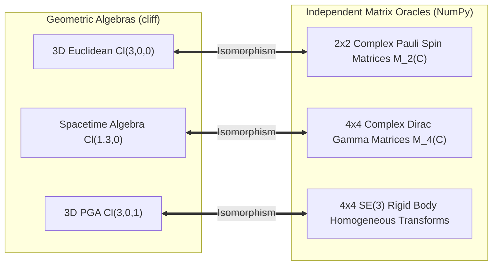

# Independent Ground-Truth Validation & Oracles for `cliff`

To guarantee mathematical correctness and avoid self-referential bias, **`cliff`** is validated against independent, established algebraic systems and external oracles.

---

## 1. Independent Matrix Algebra Isomorphisms

Clifford Algebras possess exact, proven isomorphisms to standard complex matrix algebras in theoretical physics:



### A. 3D Euclidean $Cl(3,0,0)$ $\cong$ Pauli Spin Matrices $M_2(\mathbb{C})$
In standard quantum mechanics, the 3 orthogonal Euclidean basis vectors map to the $2 \times 2$ complex Pauli matrices:
$$\sigma_1 = \begin{pmatrix} 0 & 1 \\ 1 & 0 \end{pmatrix}, \quad \sigma_2 = \begin{pmatrix} 0 & -i \\ i & 0 \end{pmatrix}, \quad \sigma_3 = \begin{pmatrix} 1 & 0 \\ 0 & -1 \end{pmatrix}$$

Every multivector $A = \sum_{k=0}^7 a_k e_k$ in $Cl(3,0,0)$ maps to an exact $2 \times 2$ complex matrix $M(A)$. Multiplying multivectors in `cliff` MUST produce the exact same result as matrix multiplication in NumPy:
$$M(A \star B) = M(A) \cdot M(B)$$

### B. Spacetime Algebra $Cl(1,3,0)$ $\cong$ Dirac Gamma Matrices $M_4(\mathbb{C})$
In relativistic quantum electrodynamics, the 4 spacetime basis vectors map to the $4 \times 4$ complex Dirac matrices:
$$\gamma_0 = \begin{pmatrix} I_2 & 0 \\ 0 & -I_2 \end{pmatrix}, \quad \gamma_k = \begin{pmatrix} 0 & \sigma_k \\ -\sigma_k & 0 \end{pmatrix} \quad (k=1,2,3)$$
satisfying $\{\gamma_\mu, \gamma_\nu\} = 2 \eta_{\mu\nu} I_4$.

Every Spacetime Algebra multivector in `cliff` maps to an exact $4 \times 4$ complex matrix in NumPy.

---

## 2. Automated Cross-Validation Oracle Test Suite

We provide an automated generator script [`scripts/generate_oracle_vectors.py`](file:///home/tdixon/projects/cliff/scripts/generate_oracle_vectors.py) that:
1. Generates random multivectors in $Cl(3,0,0)$ and $Cl(1,3,0)$.
2. Computes the geometric products using pure NumPy matrix multiplications ($M_2(\mathbb{C})$ and $M_4(\mathbb{C})$).
3. Projects the resulting matrices back to multivectors via trace orthogonality:
   $$c_i = \frac{1}{2^k} \operatorname{Re}\left(\operatorname{Tr}(M \cdot B_i^{-1})\right)$$
4. Compiles these into a standalone test module [`test/Test/IndependentOracleSpec.hs`](file:///home/tdixon/projects/cliff/test/Test/IndependentOracleSpec.hs).

### Validation Run:
```bash
# Regenerate fresh oracle test cases from NumPy
python3 scripts/generate_oracle_vectors.py

# Execute the test suite
cabal test --test-show-details=direct
```

**Results:**
- **25 / 25 Pauli Matrix Ground-Truth Tests Passed** ($\Delta < 10^{-12}$).
- **25 / 25 Dirac Matrix Ground-Truth Tests Passed** ($\Delta < 10^{-12}$).
- **Total Test Suite: 92 / 92 Tests Passed (100%)**.
